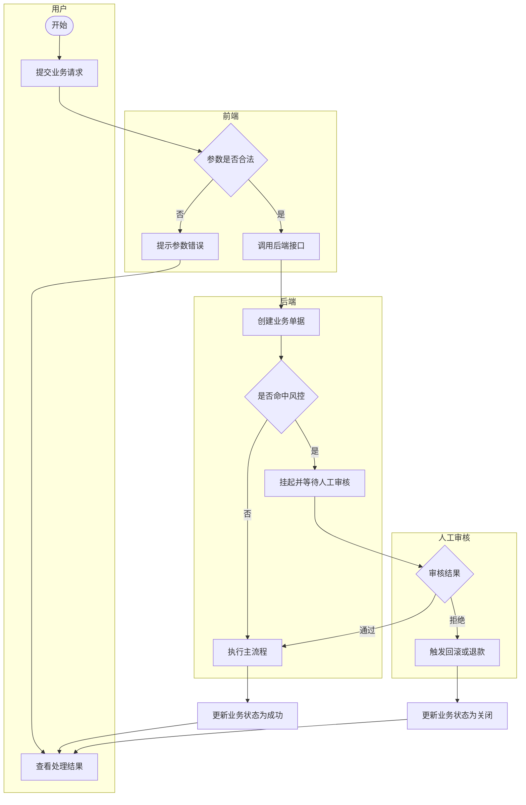
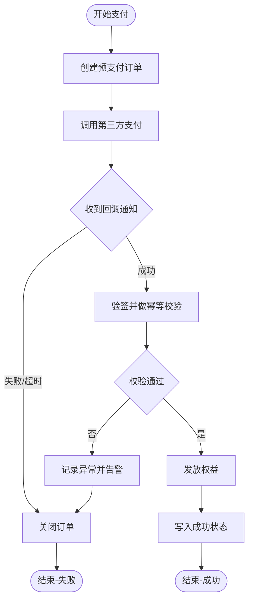

# Mermaid 流程图模板

## 模板 1：标准泳道业务流程


```mermaid
flowchart TD
    subgraph User[用户]
        A([开始]) --> B[提交业务请求]
        Z[查看处理结果]
    end

    subgraph FE[前端]
        B --> C{参数是否合法}
        C -- 否 --> D[提示参数错误]
        C -- 是 --> E[调用后端接口]
    end

    subgraph BE[后端]
        E --> F[创建业务单据]
        F --> G{是否命中风控}
        G -- 否 --> H[执行主流程]
        G -- 是 --> I[挂起并等待人工审核]
    end

    subgraph Admin[人工审核]
        I --> J{审核结果}
        J -- 通过 --> H
        J -- 拒绝 --> K[触发回滚或退款]
    end

    H --> L[更新业务状态为成功]
    K --> M[更新业务状态为关闭]
    D --> Z
    L --> Z
    M --> Z
```

## 模板 2：外部回调与异常处理


```mermaid
flowchart TD
    A([开始支付]) --> B[创建预支付订单]
    B --> C[调用第三方支付]
    C --> D{收到回调通知}
    D -- 成功 --> E[验签并做幂等校验]
    D -- 失败/超时 --> F[关闭订单]
    E --> G{校验通过}
    G -- 否 --> H[记录异常并告警]
    G -- 是 --> I[发放权益]
    I --> J[写入成功状态]
    H --> F
    F --> K([结束-失败])
    J --> L([结束-成功])
```

## 模板 3：评审确认文本模板

```text
流程目标：
关键参与方：
版本：
待确认点：
1)
2)
3)

确认语句（用户回复任一）：
- 确认保存
- 可以落盘
- 按这个版本写入仓库
```
